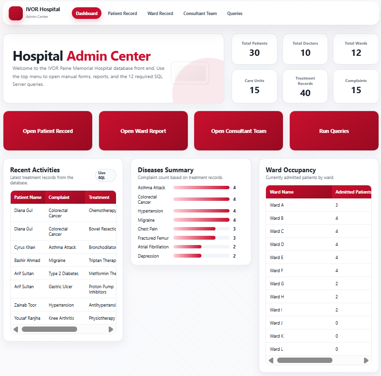
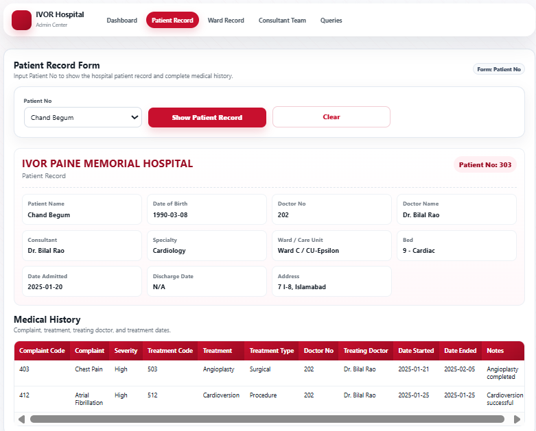
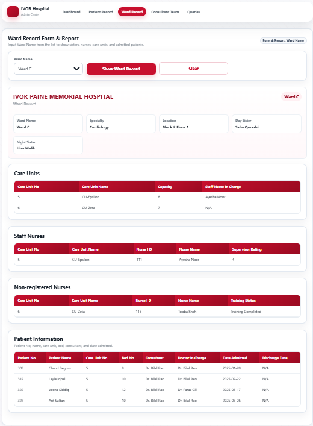
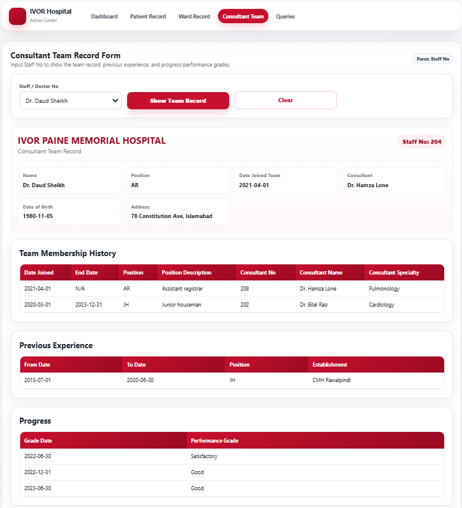
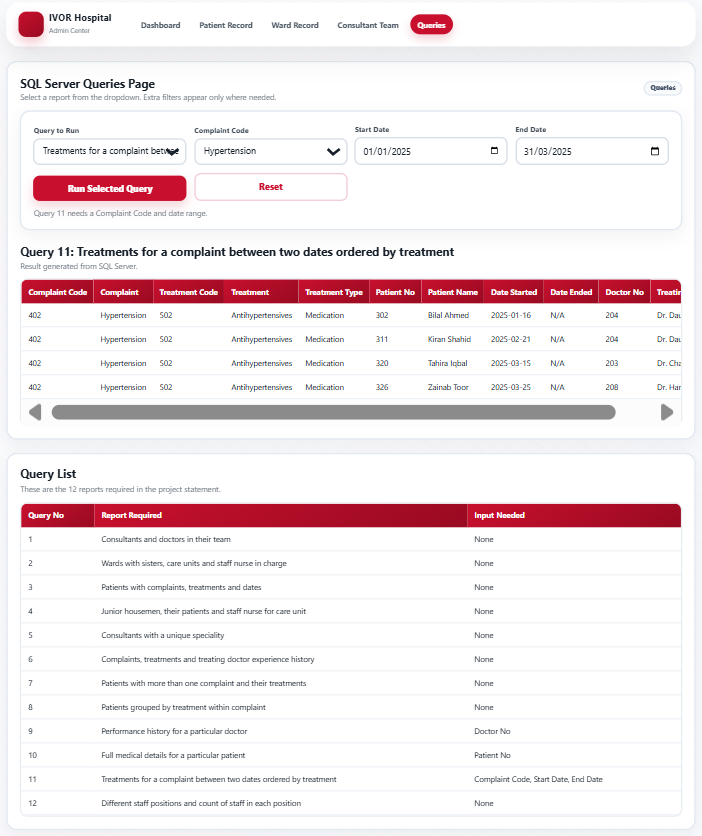

# Ivor Paine Memorial Hospital – Database System 🏥

*From EERD to relational schema to live SQL queries — a full three-phase hospital database project.*

A complete hospital database system for the fictional Ivor Paine Memorial Hospital, built across three milestones for CS 3303 - Database Systems Lab at FAST-NUCES. The project covers everything from conceptual design and normalization to SQL Server implementation and a PHP web front-end for running reports.

---

## 📸 Screenshots


*Live admin dashboard with stat cards, complaint summary, and ward occupancy*


*Full medical record lookup by patient*


*Ward structure with Day/Night Sisters and care unit assignments*


*Consultant specialty and doctor team view*


*12 SQL Server reports with live parameterized filters*


*Enhanced Entity-Relationship Diagram — full hospital domain*

---

## 🏗️ Project Overview — Three Milestones

### Milestone 1 — Conceptual Design
- **Enhanced Entity-Relationship Diagram (EERD)** modelling the full hospital domain: patients, wards, care units, beds, nurses, doctors, consultants, complaints, and treatments
- **Relational Mapping** — complete translation of the EERD to a relational schema, resolving specialization hierarchies (Nurse subtypes: DaySister, NightSister, StaffNurse, NonRegisteredNurse; Doctor subtypes: Consultant), multi-valued attributes, and weak entities

### Milestone 2 — Implementation & Normalization
- **DDL Script** — 25-table SQL Server schema with all constraints (PKs, FKs, UNIQUE, CHECK) and circular FK resolution using `ALTER TABLE`
- **Initial Insertion Script** — full seed data covering all entities
- **Normalization Report** — formal 1NF → 2NF → 3NF analysis for each table
- **Table Description Document** — attribute-level documentation for every relation

### Milestone 3 — Queries & Web Front-End
- **12 SQL Server reports** covering all project-required queries
- **PHP web application** — a full admin dashboard connecting to SQL Server, displaying live query results, patient records, ward reports, and a statistics dashboard

---

## 🗄️ Database Schema

25 tables across the full hospital domain:

| Domain | Tables |
|---|---|
| Hospital Structure | `Specialty`, `Ward`, `CareUnit`, `Bed` |
| Nurse Hierarchy | `Nurse`, `Position`, `DaySister`, `NightSister`, `StaffNurse`, `NonRegisteredNurse` |
| Nurse Details | `NursePhone`, `NurseQualifications`, `DaySisterRound` |
| Doctor Hierarchy | `Doctor`, `Consultant` |
| Doctor Details | `DoctorPhone`, `DoctorQualifications`, `DoctorTeamRecord`, `PreviousExperience`, `PerformanceHistory` |
| Patient | `Patient`, `PatientPhoneNumber` |
| Medical Records | `Complaint`, `Treatment`, `TreatmentRecord` |

---

## 🛠 Features

### 🔍 12 SQL Server Queries

| # | Report |
|---|---|
| Q1 | Consultants and the doctors in their team |
| Q2 | Wards with Day/Night Sisters, care units, and staff nurse in charge |
| Q3 | Patients with complaints, treatments, and treating doctors |
| Q4 | Junior housemen, their patients, and the staff nurse of the patient's care unit |
| Q5 | Consultants holding a unique specialty |
| Q6 | Complaints, treatments given, and treating doctor's previous experience |
| Q7 | Patients with more than one complaint and their treatments |
| Q8 | Patients grouped by treatment within complaint |
| Q9 | Performance history for a specific doctor *(parameterized)* |
| Q10 | Full medical record for a specific patient *(parameterized)* |
| Q11 | Treatments for a complaint between two dates *(parameterized)* |
| Q12 | Staff positions and headcount across all roles |

### 🌐 PHP Web Application

- **Dashboard** — live stat cards (total patients, doctors, wards, care units, treatments, complaints), recent treatment activity, complaint frequency bar chart, and ward occupancy table
- **Patient Record** — lookup full medical details for any patient by ID
- **Ward Report** — view ward structure with sisters and care unit assignments
- **Consultant Team** — view each consultant's specialty and their doctor team
- **Queries Page** — run all 12 SQL Server reports from a dropdown; parameterized queries (Q9, Q10, Q11) expose live filter controls

---

## 📁 Project Structure

```
IvorPaineHospital-Database/
│
├── Milestone1/
│   ├── EERD.drawio                         # Enhanced ER Diagram source file
│   ├── EERD.png                            # EERD diagram image
│   ├── RelationalMapping.drawio            # Relational mapping source file
│   └── RelationalMapping.png              # Relational mapping diagram image
│
├── Milestone2/
│   ├── ddlScript.sql                       # Full 25-table DDL with all constraints
│   ├── initialInsertionCommands.sql        # Seed data for all tables
│   ├── normalization.pdf                   # 1NF → 2NF → 3NF analysis
│   └── tableDescription.pdf               # Attribute-level table documentation
│
├── Milestone3/
│   ├── hospital/                           # PHP web application
│   │   ├── index.php                       # Dashboard
│   │   ├── patientRecord.php               # Patient lookup
│   │   ├── wardRecord.php                  # Ward report
│   │   ├── consultantTeam.php              # Consultant team view
│   │   ├── queries.php                     # 12-query runner
│   │   ├── config.php                      # DB connection config
│   │   ├── includes/
│   │   │   ├── database.php                # PDO connection + dashboard queries
│   │   │   ├── hospitalQueries.php         # All 12 parameterized query functions
│   │   │   ├── header.php / footer.php     # Shared layout
│   │   └── assets/
│   │       ├── style.css                   # Full app stylesheet
│   │       └── app.js                      # Query filter show/hide logic
│   └── sql/
│       ├── ddlScript.sql                   # Final DDL (updated from M2)
│       ├── initialInsertionCommands.sql    # Final seed data (updated from M2)
│       └── queries.sql                     # All 12 queries as plain SQL
```

---

## ⚙️ Prerequisites

- **SQL Server** (2019 or later) — [Download here](https://www.microsoft.com/en-us/sql-server/sql-server-downloads)
- **PHP 8.0+** with the `sqlsrv` and `pdo_sqlsrv` extensions — [PHP for Windows](https://windows.php.net/download/)
- **Microsoft Drivers for PHP for SQL Server** — [Download here](https://learn.microsoft.com/en-us/sql/connect/php/download-drivers-php-sql-server)
- A local web server — **XAMPP**, **Laragon**, or plain PHP CLI server

---

## 🚀 Setup & Run

### Step 1 — Set up the database

Open SQL Server Management Studio (SSMS) and run in order:

```sql
-- 1. Create DB and all tables
-- Run: Milestone3/sql/ddlScript.sql

-- 2. Insert seed data
-- Run: Milestone3/sql/initialInsertionCommands.sql
```

### Step 2 — Configure the web app

Open `Milestone3/hospital/config.php` and update your SQL Server credentials:

```php
define('DB_SERVER',   'localhost');   // your SQL Server instance
define('DB_DATABASE', 'IvorPaineHospital');
define('DB_USER',     'your_username');
define('DB_PASSWORD', 'your_password');
```

### Step 3 — Start the web server

From the `Milestone3/hospital/` directory:

```bash
php -S localhost:8000
```

Then open [http://localhost:8000](http://localhost:8000) in your browser.

### Running queries as plain SQL

All 12 queries are available as standalone SQL in `Milestone3/sql/queries.sql` — run them directly in SSMS. Parameterized queries (Q9, Q10, Q11) use `DECLARE` variables at the top of each block; change the values before running.

---

## 📦 Tech Stack

| Layer | Technology |
|---|---|
| Database | Microsoft SQL Server |
| Web Backend | PHP 8, PDO + sqlsrv driver |
| Web Frontend | HTML, CSS, Vanilla JS |
| ER Diagrams | draw.io |
| Query Tool | SQL Server Management Studio (SSMS) |

---

## 👨‍💻 Developer

**Muhammad Mughees Tariq Khawaja** — [LinkedIn](https://linkedin.com/in/mugheestariq)

---

## 📜 Acknowledgments

Developed as a semester project for **CL2005 - Database Systems Lab** at FAST-NUCES, Spring 2026.
